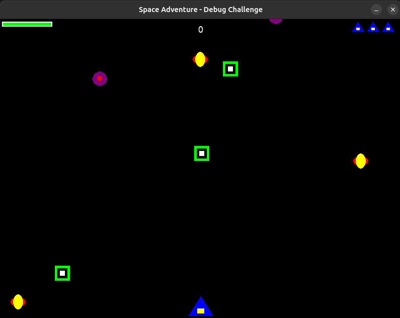

# 🚀 Galaxy Invaders

A classic arcade-style space shooter game built using Python and the Pygame library.

This project offers a chance to explore and contribute to a 2D game developed with Pygame.

---

## 📜 Project Description

Galaxy Invaders is a 2D space shooter where the player controls a spaceship to defend against waves of oncoming alien enemies. The game involves shooting, dodging, collecting power-ups, and managing health/lives. As an active development project, there might be bugs or areas where functionality deviates from the intended design.


---

## How to Play

- **Move Left:** Left Arrow Key
- **Move Right:** Right Arrow Key
- **Shoot:** Spacebar

---

## Game Features & What to Expect

### 🚀 Player Ship
- Your ship appears at the bottom of the screen.
- You start with 3 lives.
- Your ship has a shield (shown as a bar at the top left).
- When your shield is gone, you lose a life.
- When all lives are lost, the game should end automatically (It will exit the game and close the window automatically)

### 👾 Enemies
- Enemy ships come from the top and move down.
- They can also move sideways.
- If an enemy reaches the bottom or goes too far to the sides, it should reappear at the top.

### 💥 Bullets
- Shoot bullets to destroy enemies.
- Bullets go up from your ship.
- Bullets fly at a reasonable speed.
- At power level 1, you shoot one bullet.
- At power level 2 or higher, you shoot two bullets at once.

### 🛡️ Power-ups
- **Shield Power-up:** Blue circle icon. Increases your shield by 20 (up to 100).
- **Power Power-up:** Yellow icon with a red pattern. Increases your power level.
- Power-ups disappear if they go off the bottom of the screen.
- Power level upgrades last for 5 seconds, then return to normal.

#### Example Power-up Display

When you collect a power-up, you should see something like this on the screen:


If you don’t see the power-up effects or icons as shown, there may be something to improve!

### 🏆 Scoring & Display
- Destroying an enemy gives you 100 points.
- Your score is shown at the top center.
- Shield bar is at the top left.
- Lives left are shown as small ship icons at the top right.

---


## 🛠️ Tech Stack

- Python 3
- Pygame library

---

## 🚀 Getting Started

### Prerequisites

- Python 3 installed.
- pip (Python package installer) installed.

### Installation and Running

1.  Clone the repository and navigate to the project's root directory in your terminal.
2.  Install necessary Python packages (including Pygame):
    ```bash
    pip install -r requirements.txt
    ```
3.  **Important:** Generate the game's image assets (sprites):
    ```bash
    python create_sprites.py
    ```
    *(Check [IMAGE_GUIDE.md](IMAGE_GUIDE.md) for a visual explanation of the sprites after running this command.)*
4.  Start the game:
    ```bash
    python space_adventure.py
    ```
--- 

## 🚩 How to Contribute

Help us improve Galaxy Invaders!
1.  Play the game thoroughly to identify behavior that doesn't match the feature descriptions or seems incorrect (e.g., issues with scoring, lives, shields, power-ups, enemy patterns, game state). Check GitHub Issues for known bugs.
2.  Debug and correct the Python code, primarily within `space_adventure.py`, to align the game with the intended mechanics.
3.  Commit your fixes and submit them via Pull Requests (PRs) to the main repository.
4.  **Focus on logical fixes.** Ensure your code is readable and adheres to good practices. Avoid unnecessary structural changes that might disrupt existing functionality or tests.

*(Note: Potential areas needing attention include calculation errors, condition logic, power-up effects, or game state transitions. Exploring the code and gameplay is the best way to find these.)*

---

## 🧪 Testing & Validation

- Automated tests are configured to run against submitted Pull Requests.
- These tests simulate gameplay scenarios to verify that game mechanics work as expected after your fixes are applied.
- Passing the automated test suite is a requirement for merging contributions.

---

## 🙏 Thank You!

Thank you for playing and considering contributing to Galaxy Invaders!
